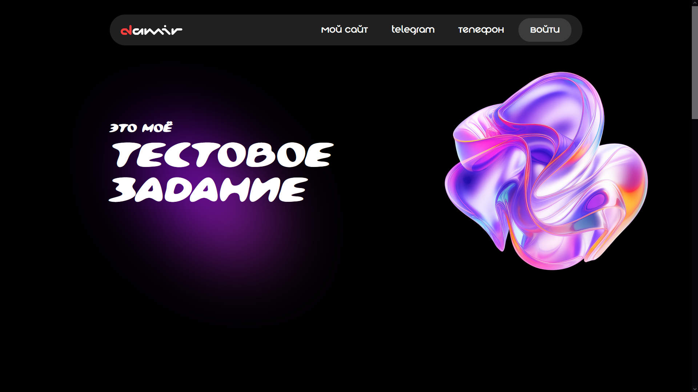
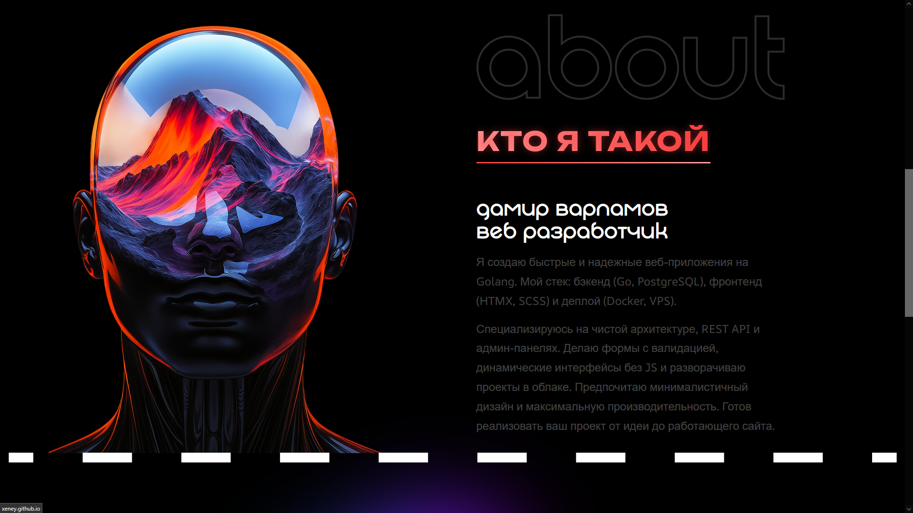
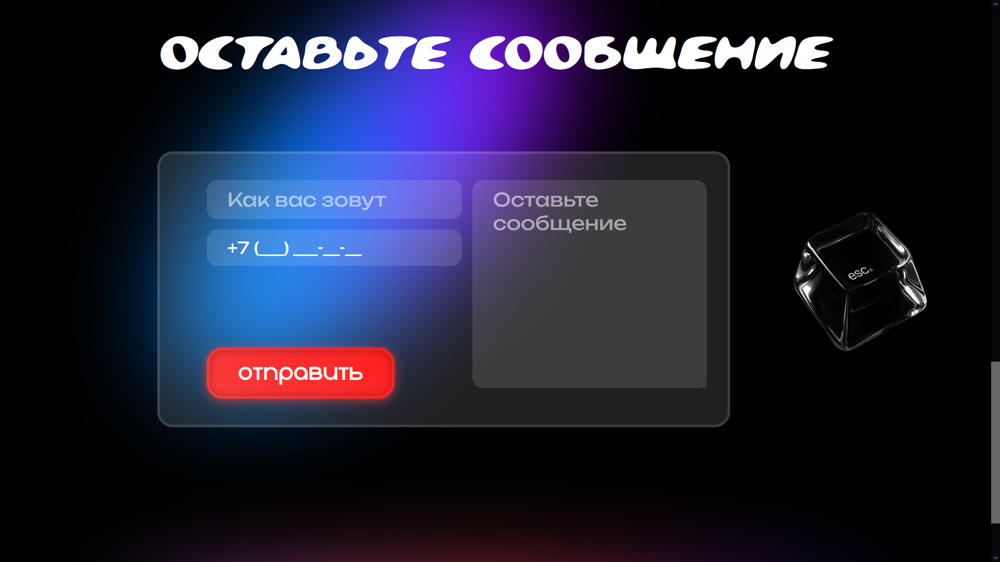
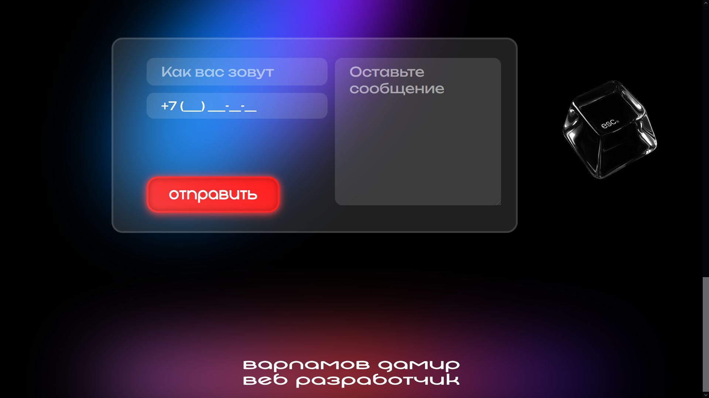
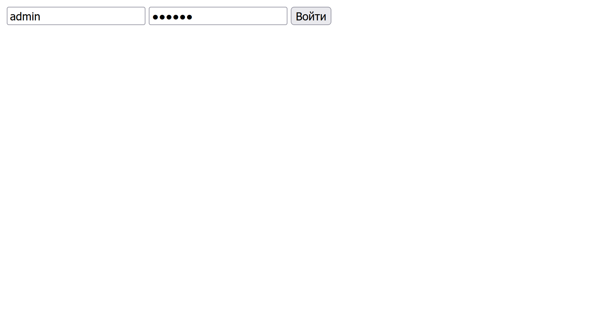
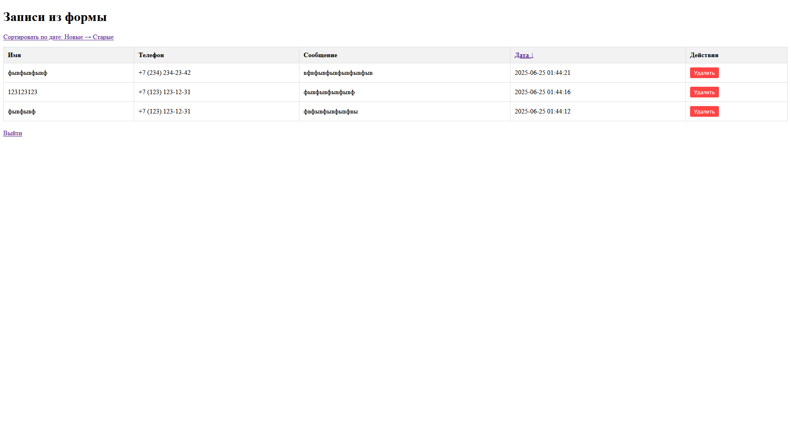

# php-test-proj
Веб-сервис для приёма и обработки заявок включает пользовательскую форму с валидацией данных и маской ввода телефона, реализующую AJAX-отправку на сервер, где данные безопасно сохраняются в MySQL через PDO. Административный интерфейс предоставляет функционал просмотра заявок с сортировкой по дате и их удаления, обеспечивая полный цикл работы с данными при защите от SQL-инъекций и XSS-атак. Проект демонстрирует комплексный подход к разработке веб-приложений с использованием чистого PHP, JavaScript и реляционной базы данных.

  
  
  
  
  
  

